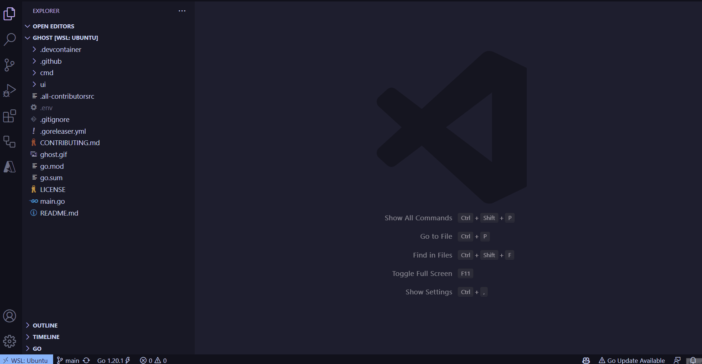

# Ghost 👻 VS Code Extension 

**This is the VS Code version of the [Ghost CLI](https://github.com/savannahostrowski/ghost)**

Ghost is an tool that intelligently scaffolds a GitHub Action workflow based on your local application stack and natural language, using OpenAI.

## Getting started
1. First, you'll need to set up an [OpenAI API key](https://platform.openai.com/account/api-keys).
2. Use "ctrl + shift + p" (Windows) or "command + shift + p" (Mac) to open the Command Palette
3. Type "Ghost" to find "Ghost: Generate GitHub Action" from the menu.

## Installation
Install the [Ghost](https://marketplace.visualstudio.com/items?itemName=SavannahOstrowski.ghost-ai) VS Code extension from the VS Code Marketplace or via Extensions in the VS Code Activity Bar.

## Contributing
Contributions are welcome! To get started, check out the [contributing guidelines](CONTRIBUTING.md).

## Contributors
A big thank you to these wonderful humans for their contributions!

<!-- ALL-CONTRIBUTORS-LIST:START - Do not remove or modify this section -->
<!-- prettier-ignore-start -->
<!-- markdownlint-disable -->

<!-- markdownlint-restore -->
<!-- prettier-ignore-end -->

<!-- ALL-CONTRIBUTORS-LIST:END -->